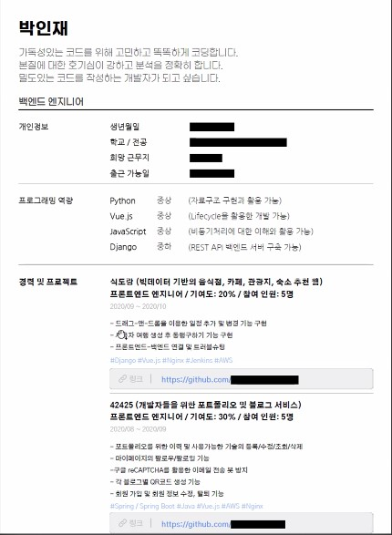

# 포트폴리오 & 프로젝트

> 자기소개서는 IT포트폴리오와 이력서로 대체되는 경우가 많음
>
> 백엔드는 프로젝트의 알고리즘과 기술 스택의 선택 이유 등을 위주로 작성
>
> 프론트엔드는 디자인과 UI, UX 등을 위주로 작성

## 포트폴리오의 필요성

1. 디지털 네이티브 회사(네카라쿠배)에 입사 지원 시 필수 문서
2. 입사 시 가장 잘 할 수 있는 직무로 배치 될 수 있게 하는 근거 문서
3. 대외 활동 및 이직시에 본인의 경력을 증명하는 기본 문서

## IT 포트폴리오의 작성 원칙3

1. 연관성의 원칙
   - 타겟 회사와 직무에 연관된 정보만 작성 (개발 관련)
   - 타겟 회사마다 문서를 편집,각색하여 사용
2. 객관성의 원칙
   - 개발능력 각각에 대한 수치화
   - 개발 스킬과 역량에 대해 객관적인 증거를 제시할 것
3. 정직성의 원칙
   - 본인이 실제로 개발한 부분에 대해서만 작성
   - 면접 시 물어봐 줬으면 하는 정보만 작성

## IT 포트폴리오의 핵심 포인트3

1. 슬로건
   - SW 개발자로서 정체성을 한 문장으로 표현하는 것
   - 
2. 프로필
   - 어떠한 과정을 통해 SW개발자로 성장해왔는지에 대한 나의 경험
   - 사진은 선택사항이지만 가급적 넣는 것이 좋은 첫인상에 유리함
   - 희망 직무는 되도록 하나만 작성하는게 좋다 (풀스택 가능)
   - 깃허브/기술 블로그 태그 가능
   - 짧고 부르기 쉬운 별도의 명칭으로 프로젝트 명명
   - 프로젝트의 구현기능이나 성능을 구체적으로 서술 (+사용한 기술 스택)
   - 
3. 프로젝트
   - 참여한 개발 프로젝트에 따른 개인 경험을 상세히 작성
   - 내가 개발에 참여한 화면, 팀명, 로고 등을 넣어 표지를 장식 (출력 고려)
   - 참여인원과 기여도 입력
   - 프로젝트 구현 목적, 이유, 결과, 배운 점 입력

# 이력서

> pdf양식에 5mb이하로 작성하는것 추천

# Design Thinking

> 사람들이 겪는 불편함을 인간 중심적 관점으로 찾아내어 해결하는 창의적 문제해결 방법론
>
> (적합성, 실현가능성, 지속성의 교집합을 찾는 것)

## 창의적 아이디어의 특징

1. 사람들이 겪는 불편함이 시작점 (나의 불편함 X)
2. 적합성, 실현가능성, 지속성의 기준이 확실

## Design Thinking의 과정

1. 공감하기
   - 관찰, 인터뷰, 감정이입 등의 방법으로 사용자의 입장에서 상황을 바라보고 깊이 공감하는 과정
2. 문제정의하기
   - 공감하기 단계에서 발견된 문제들 중 가장 올바르고 가치있고 영감을 주는 관점에 입각하여 해결할 "진짜 문제" 선정
3. 아이디어 내기
   - 정의한 문제를 해결하기 위해 브레인스토밍, 바디스토밍 등 다양한 방법의 과정을 반복하여 최대한 많은 양의 아이디어를 도출
4. 프로토타입 만들기
   - 형식에 제한을 두지 않고 단시간 내에 저렴한 재료들을 이용하여 추상적인 아이디어를 구체적, 시각적으로 표현
5. 테스트하기
   - 사용자에게 프로토타입을 보여주고 피드백을 받아 개선해 나가는 반복적인 과정을 통해 아이디어 검증 및 발전

